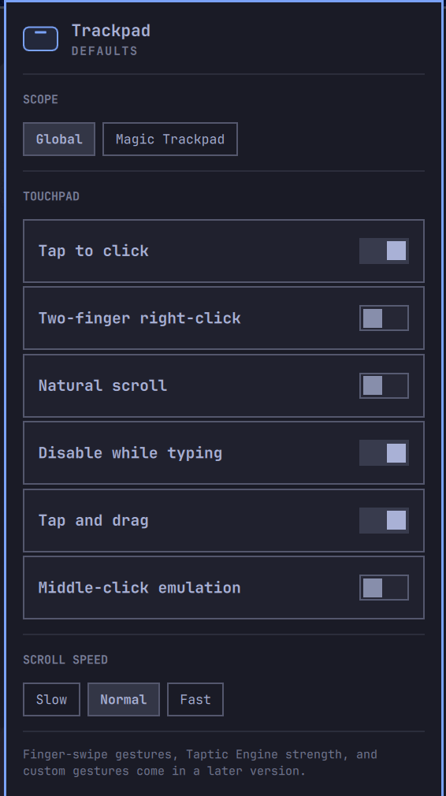
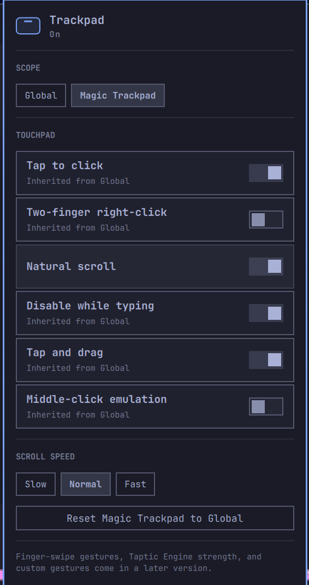

# Magic Trackpad — an Omarchy bar plugin

**Your trackpad, tuned from the bar.** A [Quickshell](https://quickshell.org/)
bar widget for [Omarchy](https://omarchy.org/) that puts the libinput touchpad
knobs Hyprland already has one click away — no `input.lua` spelunking, no
`hyprctl` incantations to memorize.

[](https://github.com/andrewmp1/omarchy-magic-trackpad/actions/workflows/ci.yml)
&nbsp;·&nbsp; MIT
&nbsp;·&nbsp; Omarchy 4 / Hyprland 0.56 / Quickshell 0.3
&nbsp;·&nbsp; [Website](https://andrewmp1.github.io/omarchy-magic-trackpad/)

<p align="center">
  
</p>

## Why

- **It's the trackpad pane Omarchy doesn't ship.** Tap-to-click, two-finger
  right-click, natural scroll, scroll speed, disable-while-typing — the
  settings everyone changes, in a panel instead of a text file.
- **Instant.** Flip a switch and libinput reacts *now* — the panel talks to
  the running Hyprland with `hl.config`, not a config reload.
- **Persistent and reversible.** Choices go to one JSON file and a managed
  `~/.config/hypr/*.lua` that Hyprland sources on every load. Remove the
  plugin, delete two files — your config is byte-for-byte back.
- **Reads your real state.** Options you've never touched show Hyprland's
  current value; the plugin only writes the ones you actually change.
- **No daemon. No root. No device access. No dependencies.** Everything here
  is a plain libinput/Hyprland setting driven through `hyprctl`, which every
  Omarchy install already has.
- **Native to the bar.** Themed by your Omarchy theme, keyboard-navigable
  (`j`/`k`, `Enter`, `Esc`), and it does not spawn a second Quickshell.

## What it controls

| | |
|---|---|
| **Tap to click** | tap the pad instead of pressing down |
| **Two-finger right-click** | 2 fingers → right, 3 → middle (`clickfinger_behavior`) |
| **Natural scroll** | content follows the fingers |
| **Disable while typing** | ignore the pad briefly after a keypress |
| **Tap and drag** | tap-tap-hold to start a drag |
| **Middle-click emulation** | left + right together → middle |
| **Scroll speed** | Slow · Normal · Fast (`scroll_factor` 0.2 / 0.4 / 0.8) |

### Scopes

A **Scope** picker at the top of the panel switches between **Global** and each
touchpad the system reports. Global writes Hyprland's `input.touchpad` section;
picking a specific pad writes an `hl.device` block for that pad only. A device
scope inherits every option it hasn't overridden from Global — so you can, say,
leave natural scroll on for the laptop's built-in pad and turn it off on a
plugged-in Magic Trackpad. **Reset to Global** clears a device's overrides in
one step. With no external touchpad connected the picker stays hidden and the
panel behaves exactly as it did in v0.1.

<p align="center">
  
</p>

## Install

```sh
omarchy plugin add https://github.com/andrewmp1/omarchy-magic-trackpad.git --enable --yes
omarchy bar move andrewmp1.magic-trackpad --section right   # optional placement
```

Plugins land disabled for review; `--enable` opts in. Plugin code runs
unsandboxed inside `omarchy-shell` — read it first. Left-click the trackpad
glyph in the bar to open the panel.

<details>
<summary>Install from a local checkout (development)</summary>

```sh
git clone https://github.com/andrewmp1/omarchy-magic-trackpad.git
ln -s "$PWD/omarchy-magic-trackpad" ~/.config/omarchy/plugins/andrewmp1.magic-trackpad
omarchy restart shell
omarchy plugin enable andrewmp1.magic-trackpad
```
</details>

## How it works

- The panel's settings document is `~/.config/omarchy/magic-trackpad.json` —
  plain JSON you can read, diff, and keep in your dotfiles. It has a `global`
  section and a `devices` map; a v0.1 document is migrated on first load.
- A Global change is applied live with `hyprctl eval "hl.config({ input = {
  touchpad = { … } } })"`; a device change with `hyprctl eval "hl.device({
  name = "<slug>", … })"` (Omarchy runs Hyprland's Lua config parser, which
  rejects `hyprctl keyword`). Touchpads are found by cross-referencing
  `hyprctl devices` with `/proc/bus/input/devices`; only device names matching
  Hyprland's own slug shape are ever used.
- The same change is written to `~/.config/hypr/omarchy-magic-trackpad.lua`,
  loaded by one guarded `dofile` line the plugin appends to `hyprland.lua`, so
  it survives a restart.

| Path | Purpose |
|---|---|
| `~/.config/omarchy/magic-trackpad.json` | your settings (source of truth; delete to reset) |
| `~/.config/hypr/omarchy-magic-trackpad.lua` | generated — re-applies your settings on every Hyprland load |
| `~/.config/hypr/hyprland.lua` | +1 guarded loader line (`-- omarchy-magic-trackpad`) |

## Security boundary

The plugin's entire footprint, for the record:

- **Runs:** `hyprctl` and `/usr/bin/dd` (coreutils — capped, no-symlink reads
  of its own config files and `/proc/bus/input/devices`). Nothing else. No
  daemon, no listener, no network.
- **Untrusted input:** `hyprctl` output, device name strings, and the panel
  summary are treated as data — every `Text` sink is `PlainText`, and a device
  name reaches an `hl.device` / argv only if it matches an anchored
  `^[a-z0-9][a-z0-9._-]{0,127}$` (refused, never repaired, otherwise).
- **Writes:** only the three paths in the table above.
- **Escalation:** none. No `sudo`, no `pkexec`, no systemd units, no udev
  rules, no device nodes — the plugin runs as your user inside
  `omarchy-shell`.
- **Removal:** delete the plugin and the two config files and every trace is
  gone; the loader line in `hyprland.lua` is the only edit to an existing
  file, and it's one guarded, commented line.

Code staged for the planned haptics phase (`magic-haptic`, the udev setup)
is root-capable and therefore **deliberately not vendored in this repo** —
`omarchy plugin add` ships the whole checkout into your plugin directory.
It lives in the
[magic-trackpad-haptics](https://github.com/andrewmp1/magic-trackpad-haptics)
research repo and will be re-added, separately reviewed, only when that
phase actually ships.

## Tested

Six layers, run by `bash scripts/check.sh`:

1. **Unit** — config normalization (incl. v1 → v2 config-document migration), touchpad
   detection, the scope cascade, the exact `hl.config` / `hl.device` strings,
   the apply plan.
2. **Manifest** — schema + `BarWidget.qml` `moduleName` stays in step with the id.
3. **Config syntax** — the generated `.lua` is parsed with `luac` (a syntax
   error there would break your whole Hyprland config).
4. **Hyprland contract** — every setting, applied with the plugin's own
   command, actually moves `hyprctl getoption`. The tripwire for API drift.
5. **Shell smoke** — the plugin loads into a running `omarchy-shell` and the
   panel opens with no QML error in the journal.
6. **Panel e2e** — synthetic keystrokes (`wtype`) drive the rendered panel and
   confirm the real Hyprland option, the saved document (Global and a device
   scope), and persistence across `hyprctl reload`.

```sh
npm test               # layers 1-3 (portable — also what CI runs)
npm run test:contract  # layer 4
bash scripts/check.sh  # all six, skipping any that can't run here
```

Layers 1-3 run in CI on every push; 4-6 need a live desktop. Full menu and a
manual release checklist: **[docs/TESTING.md](docs/TESTING.md)**.

## Contributing

Issues and PRs welcome.

- **Found a bug?** Open an
  [issue](https://github.com/andrewmp1/omarchy-magic-trackpad/issues/new/choose)
  and fill in the template — `omarchy version`, `hyprctl version`, and the
  output of `bash scripts/check.sh` go a long way.
- **Sending a PR?** Read [CONTRIBUTING.md](CONTRIBUTING.md) and
  [AGENTS.md](docs/AGENTS.md) (architecture + the Omarchy-plugin gotchas), run
  `bash scripts/check.sh`, and keep `Model.js` pure so `node --test` still
  covers the logic.

## Publishing

Not on the marketplace yet. When it goes up:
`omarchy plugin validate .`, then the submission form at
[omacom/omarchy-plugin-marketplace](https://github.com/omacom/omarchy-plugin-marketplace/issues/new?template=submit-plugin.yml).
Full checklist: [docs/PUBLISHING.md](docs/PUBLISHING.md).

## Roadmap

- **v0.4 — finger swipes.** 3/4-finger → switch workspace. Held back because a
  runtime `hl.gesture` can't be cleanly un-registered yet.
- **Haptics.** Apple Magic Trackpad Taptic Engine strength (Off / Low / Medium
  / High) and click recovery. The backend is prototyped in the
  [magic-trackpad-haptics](https://github.com/andrewmp1/magic-trackpad-haptics)
  research repo; it needs a udev rule and a small daemon, so it ships as a
  deliberate, separately reviewed addition.
- **Custom gestures.** Finger-count buttons, force-press, corner taps via an
  opt-in userspace daemon.

## Uninstall

```sh
omarchy plugin remove andrewmp1.magic-trackpad --yes
rm -f ~/.config/hypr/omarchy-magic-trackpad.lua ~/.config/omarchy/magic-trackpad.json
# then delete the `-- omarchy-magic-trackpad` line from ~/.config/hypr/hyprland.lua
```

## License

MIT © 2026 Drew Purdy.
